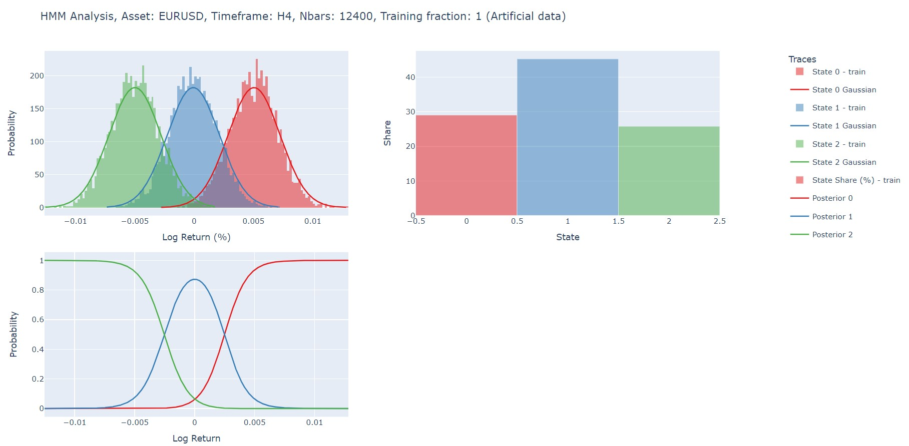
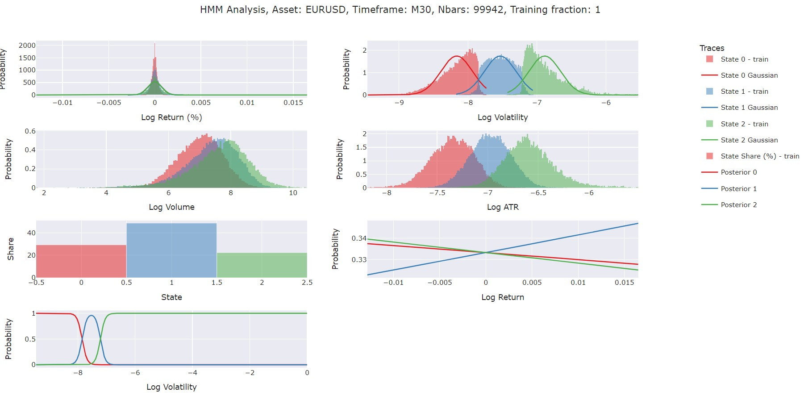
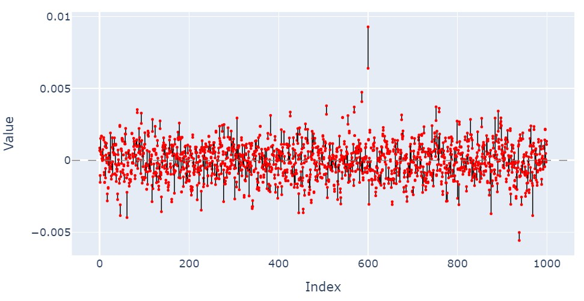
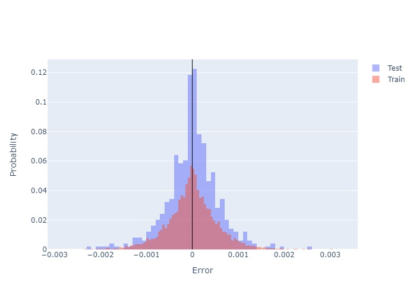
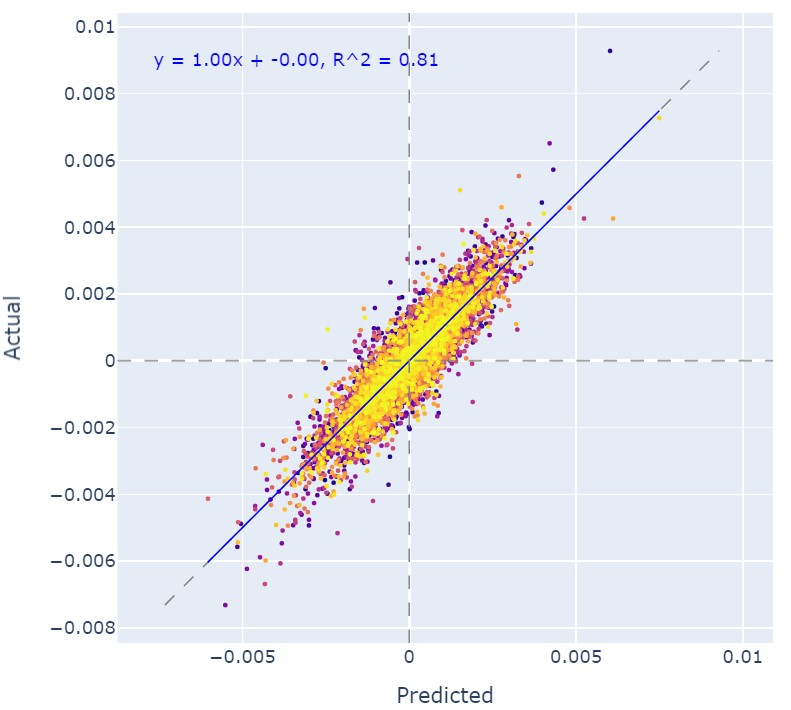
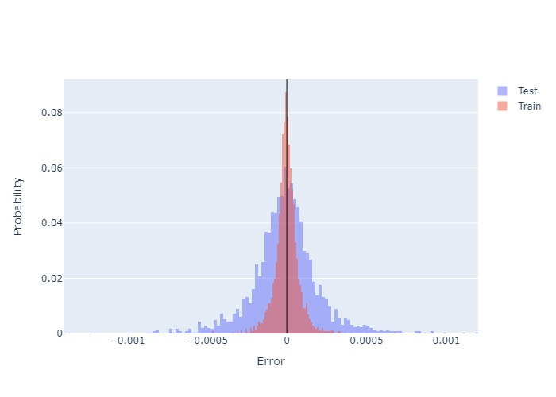

# Financial Market Regime Detection and Prediction

This project provides tools to analyze and predict market regimes and asset prices using advanced statistical and machine learning models. It supports financial data for forex, stocks, and cryptocurrencies, working seamlessly with **MetaTrader 5 (MT5)** to fetch historical data.  

The models implemented include:  
1. **Hidden Markov Model (HMM)**  
2. **Artificial Neural Network (ANN)**  
3. **Random Forest (RF)**  

---

## Table of Contents  
- [Overview of Models](#overview-of-models)  
  - [Hidden Markov Model (HMM)](#hidden-markov-model-hmm)  
  - [Artificial Neural Network (ANN)](#artificial-neural-network-ann)  
  - [Random Forest (RF)](#random-forest-rf)  
- [Features](#features)  
- [Usage](#usage)  
- [Evaluation Metrics](#evaluation-metrics)  
- [Visualizations](#visualizations)  
- [Future Enhancements](#future-enhancements)  

---

## Overview of Models  

### Hidden Markov Model (HMM)  
The HMM is used to uncover **hidden market regimes** (e.g., bullish, bearish, neutral) from financial data.  
- **Features**:  
    - Return or log return  
    - Log volatility  
    - Log volume  
    - Log ATR
    - Any other relevant financial, technical, or macroeconomic indicators.  
- **Visualizations**:  
    - Histograms of features for each hidden state  
    - Posterior probabilities for hidden states across data points  
- **Insights**:  
    - Analyze the interplay between hidden states and features.
    - Bullish: Typically associated with positive returns and low volatility.
    - Bearish: Usually correlates with negative returns and high volatility.
    - Neutral: Moderate returns with medium volatility.
- **Cautionary Note**: Misalignment of state characteristics (e.g., bearish with low volatility) may indicate data issues or unexpected market conditions.  

---

### Artificial Neural Network (ANN)  
The ANN model predicts **price movements** by learning from lagged feature data.  
- **Input Features**:  
    - Lagged values of:  
        - Return or log return  
        - Volatility or log volatility  
        - Volume or log volume  
        - Technical indicators (e.g., RSI, ADX, ATR)  
        - Macroeconomic indicators (e.g., S&P 500, Treasury bond rates, Real Estate ETF)  
    - Use EMA features instead of raw values for better fit. Accuracy of the model will be lower if EMA is used, but it will be more robust. For instance, the raw log return values are more noisy than the EMA values.  
- **Architecture**:  
    - Customizable number of layers and number of hidden neurons in each layer to balance complexity and performance. Hyperparameter tuning is recommended for optimal results.
- **Usage**:  
    - Target could be close price, or return. It is recommended that return values should be used as target since they are stationary as opposed to close prices.

---

### Random Forest (RF)  
The Random Forest model also predicts **market regimes** or **price movements**, leveraging the robustness of ensemble methods.  
- **Input Features**:  
    - Same as ANN (lagged financial, technical, and macroeconomic indicators). 
    - Again, use lagged EMA features instead of raw values for better performance. 
- **Architectures**:
    - Number of trees and tree depth can be adjusted for optimal performance.  
    - Hyperparameter tuning is recommended for better results.
- **Advantages**:  
    - Handles non-linear relationships and noisy data effectively.  
    - Provides feature importance for better interpretability.
    - Can be used to determine which features behave close to each other.

---

## Features  

1. **Wide Range of Inputs**:  
    - Financial data: Forex, stocks, crypto. MT5 API for data fetching. Yfinance can also be used alternatively.
    - Indicators: pandas_ta and macroeconomic variables.  

2. **Customizable Timeframes**:  
    - Works on data from **as small as 1-minute to 1-week timeframes**.  

3. **Multi-Model Flexibility**:  
    - HMM for market regime classification.  
    - ANN and RF for predictive tasks.  

4. **MetaTrader 5 Integration**:  
    - Fetch data with the MT5 Python API using demo accounts (e.g., Pepperstone).  

5. **Interactive Visualizations**:  
    - HMM state analysis.  
    - ANN and RF error and regression diagnostics.  

---

## Usage  

1. Fetch data using MT5 Python API.  
2. Run the selected model:  
    - HMM: Uncover hidden regimes.  
    - ANN or RF: Predict future market regimes or asset prices.  
3. Train the model on selected features.  
4. Visualize the results using the built-in plotting functions.  

---

## Evaluation Metrics  

1. **HMM**:  
    - Histogram of features by hidden state.  
    - Posterior probabilities across data points.  

2. **ANN and RF**:  
    - **Error Histogram**: Distribution of prediction errors.  
    - **Regression Line**: Compare predictions to actual values.  
    - **Feature Importance (RF only)**: Identify which features impact predictions the most.  

---

## Visualizations  

- Interactive **Plotly Dashboards**:  
    - Explore feature histograms, regression lines, and error metrics interactively using Plotly.

---

## Future Enhancements  

- Feature engineering for ANN and RF models. 
- Optimize ANN architecture for specific asset types.  
- Integrate advanced HMMs (e.g., Bayesian or hierarchical models).
- Integrate with backtesting platforms for strategy testing.

---
## Some Results
- HMM:  
    - 
    - 
- ANN:
    - 
    - 
    - 
- RF:
    - 
    - 
## Acknowledgments  

- **MT5 Python API** for data fetching.  
- **hmmlearn**, **scikit-learn**, and **PyTorch** for model implementations.  
- **Plotly** for interactive visualizations.  

---

Feel free to contribute or report issues. Let’s decode the markets together! 🚀  