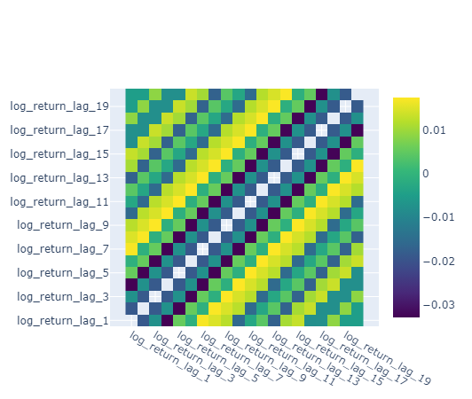
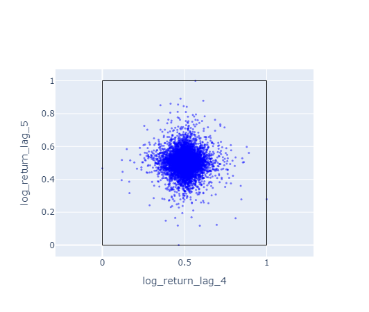
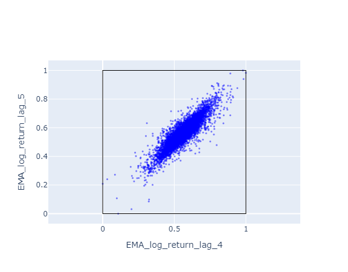
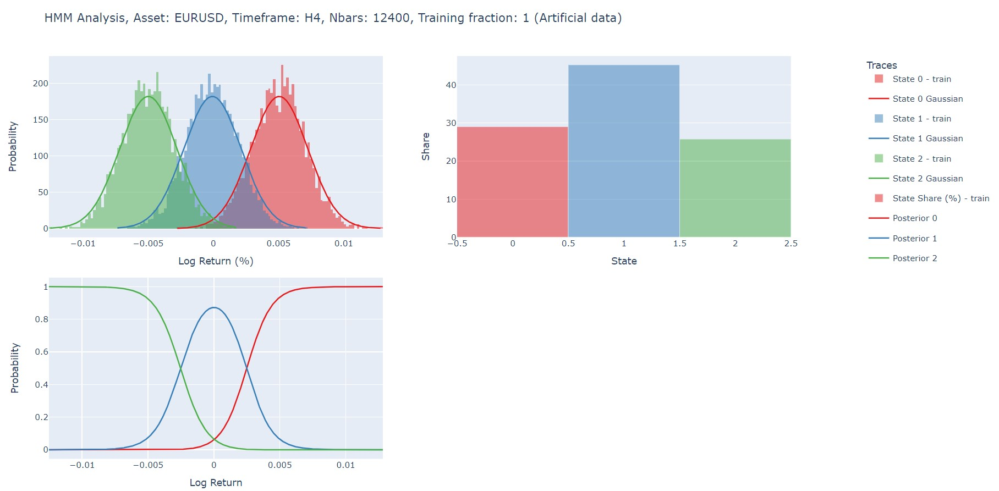
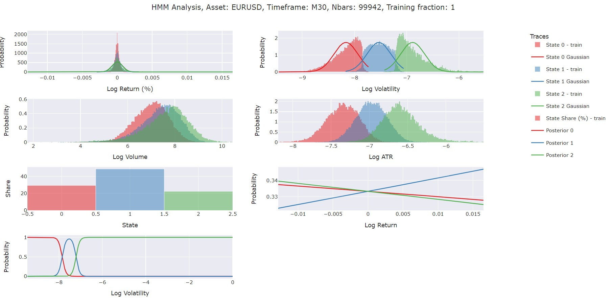
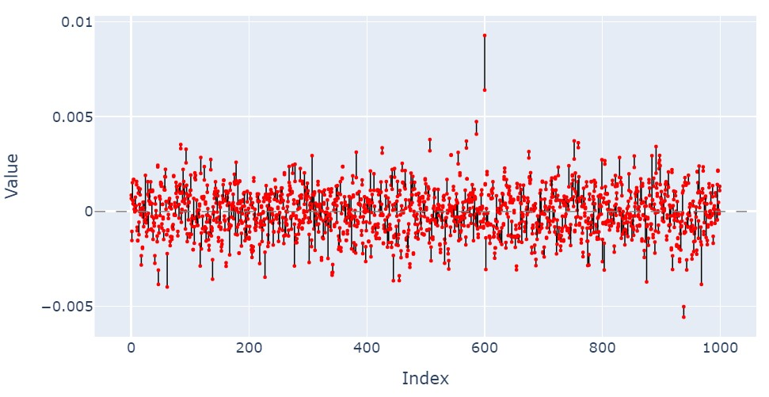
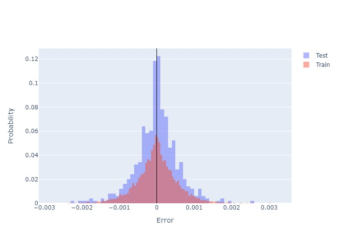
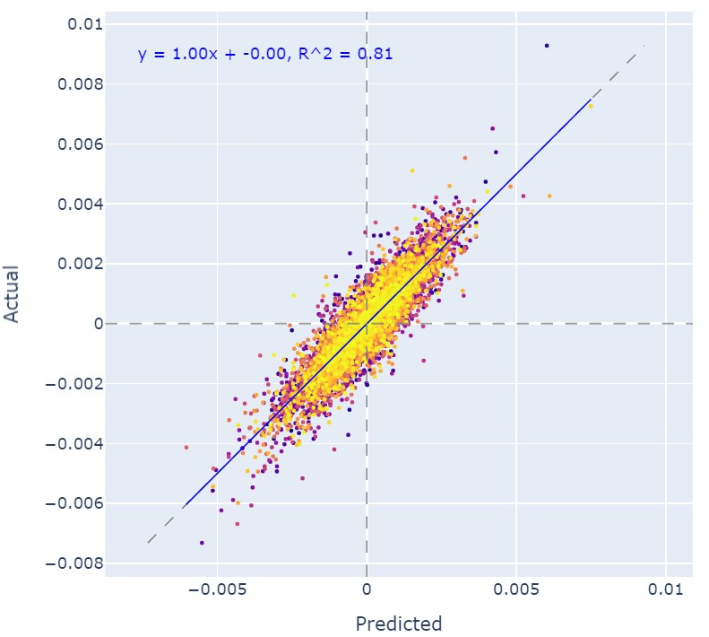
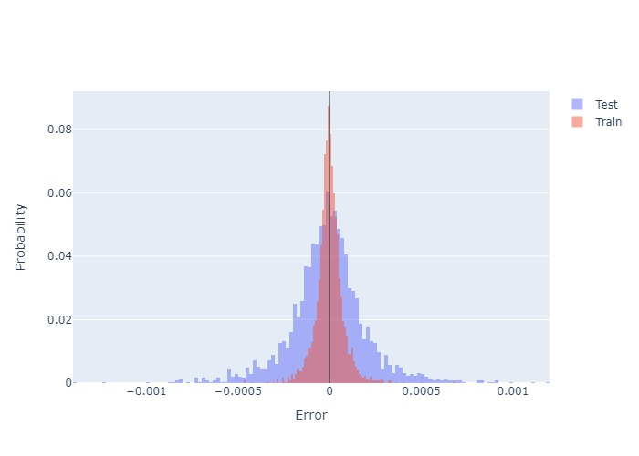
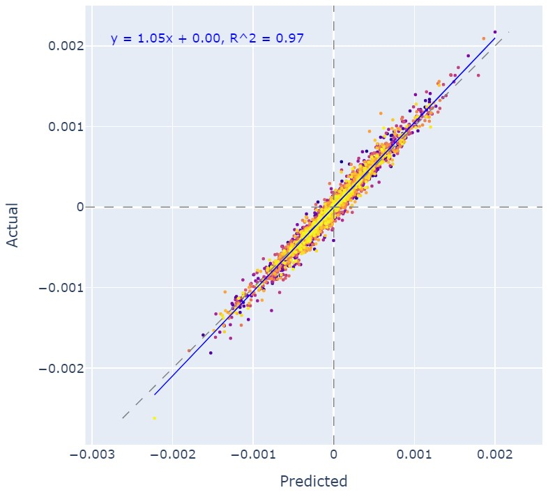

# Machine Learning Tools for Market Regime Analysis and Price Prediction

This project provides tools to analyze and predict market regimes and asset prices using advanced statistical and machine learning models. The aim is not to be as comprehensive as possible but to provide a starting point for further research. It supports financial data for forex, stocks, and cryptocurrencies, working with **MetaTrader 5 (MT5)** to fetch historical data.  

The models implemented include:  
1. **Hidden Markov Model (HMM)**  
2. **Artificial Neural Network (ANN)**  
3. **Random Forest (RF)**  

---

## Table of Contents  
- [Overview of Models](#overview-of-models)  
    - [Hidden Markov Model (HMM)](#hidden-markov-model-hmm)  
    - [Artificial Neural Network (ANN)](#artificial-neural-network-ann)  
    - [Random Forest (RF)](#random-forest-rf)  
- [Features](#features)  
- [Usage](#usage)  
- [Evaluation Metrics](#evaluation-metrics)  
- [Visualizations](#visualizations)  
- [Future Enhancements](#future-enhancements)  
- [Some Results](#some-results)


---

## Overview of Models  

### Hidden Markov Model (HMM)  
The HMM is used to uncover **hidden market regimes** (e.g., bullish, bearish, neutral) from financial data.  
- **Features**:  
    - Return or log return  
    - Log volatility  
    - Log volume  
    - Log ATR
    - Any other relevant financial, technical, or macroeconomic indicators.  
- **Visualizations**:  
    - Histograms of features for each hidden state  
    - Posterior probabilities for hidden states across data points  
- **Insights**:  
    - Analyze the interplay between hidden states and features.
    - Bullish: Typically associated with positive returns and low volatility.
    - Bearish: Usually correlates with negative returns and high volatility.
    - Neutral: Moderate returns with medium volatility.

**Cautionary Note**: When HMM is trained on two sets of features (e.g., return and volatility), the relationship between the features are important. For example, if bearish regimes are associated with high volatility, the model will (ideally) learn this relationship. So it is important to choose features that have a relationship with each other in all the regimes. For another example, let's say volume is to be used as a feature in addition to return and volatility. The user should ask themselves if the volume the following questions:
> In bearish regimes, when returns are negative and volatility is high, does volume follow a certain pattern? If yes, then volume can be used as a feature. If not, then it is not a good idea to use volume as a feature. 

After all, each hidden state should be associated with a certain pattern of features. Meaning to say, all features should be separated by the hidden states.  

---

### Artificial Neural Network (ANN)  
The ANN model predicts **price movements** by learning from lagged feature data.  
- **Input Features**:  
    - Lagged values of:  
        - Return or log return  
        - Volatility or log volatility  
        - Volume or log volume  
        - Technical indicators (e.g., RSI, ADX, ATR)  
        - Macroeconomic indicators (e.g., S&P 500, Treasury bond rates, Real Estate ETF)  
    - Use EMA features instead of raw values for better fit. Accuracy of the model will be lower if EMA is used, but it will be more robust. For instance, the raw log return values are more noisy than the EMA values.  
- **Architecture**:  
    - Customizable number of layers and number of hidden neurons in each layer to balance complexity and performance. Hyperparameter tuning is recommended for optimal results.
- **Usage**:  
    - Target could be close price, or return. It is recommended that return values should be used as target since they are stationary as opposed to close prices.

For ANN it is extremely important to normalize the data. The following code is used to normalize the data:
```python
from sklearn.preprocessing import MinMaxScaler
scaler_X = MinMaxScaler()
scaler_y = MinMaxScaler()
X = scaler_X.fit_transform(X)
y = scaler_y.fit_transform(y.reshape(-1, 1))
```

One important aspect of ANN is to choose the right features. One metric that should always be checked in my view is the correlation between the features. If two features are highly correlated, one of them should be removed. The reduncancy in information will not help the model to learn the patterns and it only increases the complexity of the model. To visually see the correlation between different features, one can use `plot_features_correlation_matrix` function. The matrix looks something like this when lagged log returns are used as features:



Notice that the highest and the lowest correlation are 0.01 and -0.03 respectively. This is a good sign in my view because the features are not correlated with each other and each of them can provide different information to the model.  
Now compare it to the correlation matrix when exponential moving averages of log returns are used as features:


As expected, the correlation between the lagged EMA features are much larger than that of the raw lagged features. This is because of the nature of the EMA that gives more weight to the recent values. That is why using EMA features are probably not that much helpful at least in this fashion in my opinion. Simply because the correlation between the features are too high.

Below the correlation between two features are shown for both EMA version and raw version of log returns.

Raw log return |  EMA log return
-- | --
  |  

---

### Random Forest (RF)  
The Random Forest model also predicts **market regimes** or **price movements**, leveraging the robustness of ensemble methods.  
- **Input Features**:  
    - Same as ANN (lagged financial, technical, and macroeconomic indicators). 
    - Again, use lagged EMA features instead of raw values for better performance. 
- **Architectures**:
    - Number of trees and tree depth can be adjusted for optimal performance.  
    - Hyperparameter tuning is recommended for better results.
- **Advantages**:  
    - Handles non-linear relationships and noisy data effectively.  
    - Provides feature importance for better interpretability.
    - Can be used to determine which features behave close to each other.

---

## Features  

1. **Wide Range of Inputs**:  
    - Financial data: Forex, stocks, crypto. MT5 API for data fetching. Yfinance can also be used alternatively.
    - Indicators: pandas_ta and macroeconomic variables.  

2. **Customizable Timeframes**:  
    - Works on data from **as small as 1-minute to 1-week timeframes**.  

3. **Multi-Model Flexibility**:  
    - HMM for market regime classification.  
    - ANN and RF for predictive tasks.  

4. **MetaTrader 5 Integration**:  
    - Fetch data with the MT5 Python API using demo accounts (e.g., Pepperstone).  

5. **Interactive Visualizations**:  
    - HMM state analysis.  
    - ANN and RF error and regression diagnostics.  

---

## Usage  

1. Fetch data using MT5 Python API.  
2. Run the selected model:  
    - HMM: Uncover hidden regimes.  
    - ANN or RF: Predict future market regimes or asset prices.  
3. Train the model on selected features.  
4. Visualize the results using the built-in plotting functions.  

---

## Evaluation Metrics  

1. **HMM**:  
    - Histogram of features by hidden state.  
    - Posterior probabilities across data points.  

2. **ANN and RF**:  
    - **Error Histogram**: Distribution of prediction errors.  
    - **Regression Line**: Compare predictions to actual values.  
    - **Feature Importance (RF only)**: Identify which features impact predictions the most.  

---

## Visualizations  

- Interactive **Plotly Dashboards**:  
    - Explore feature histograms, regression lines, and error metrics interactively using Plotly.

---

## Future Enhancements  

- Feature engineering for ANN and RF models. 
- Optimize ANN architecture for specific asset types.  
- Integrate advanced HMMs (e.g., Bayesian or hierarchical models).
- Integrate with backtesting platforms for strategy testing.

---
## Some Results
### HMM:  
Three different regimes are separated by the HMM model. Posterior probabilities are shown for each value of observation (in this case H4 log return of EURUSD). It is clear that the model is able to separate the regimes effectively for the given aritificial data. 

When using real data the regime separation is not as clear as the artificial data. The model is still able to separate some of the regimes effectively. But the separated regimes are not necessarily the same as the expected regimes. We expected the separated regimes to be bullish, bearish, and neutral. But the separated regimes are high, medium, and low volatility. My guess is that the transition matrices are not well initialized. I tried to use a random initialization for the transition matrices but didn't get any better results. Most of the time the model does not converge. Overall my observation is that the model is very sensitive to the initialization of the transition matrices, covariance matrices, and means. For initialization, the following code is used:
```python
model.transmat_ = np.array([
    [main_diag[0], (1 - main_diag[0]) / 2, (1 - main_diag[0]) / 2],
    [(1 - main_diag[1]) / 2, main_diag[1], (1 - main_diag[1]) / 2],
    [(1 - main_diag[2]) / 2, (1 - main_diag[2]) / 2, main_diag[2]]
])
``` 

### ANN:
The graphs below shows the difference between actual and predicted values for the ANN model.



### RF:
The graphs below shows the difference between actual and predicted values for the RF model.


## Acknowledgments  

- **MT5 Python API** for data fetching.  
- **hmmlearn**, **scikit-learn**, and **PyTorch** for model implementations.  
- **Plotly** for interactive visualizations.  

---